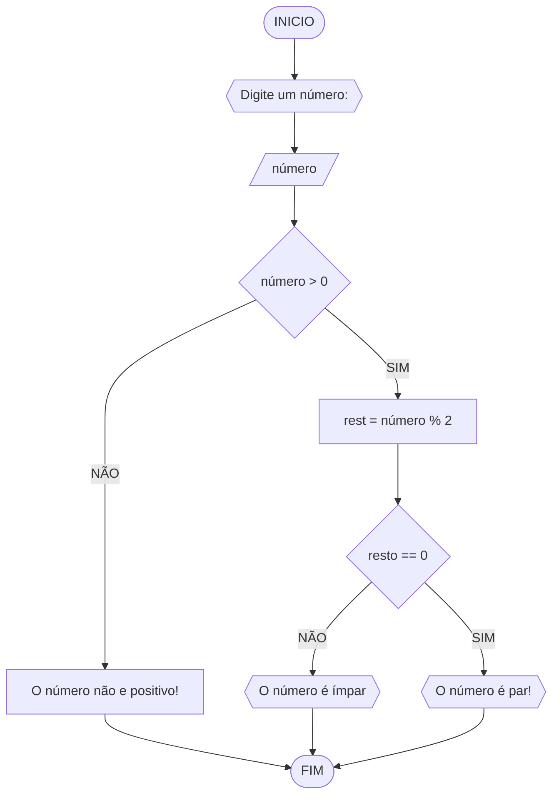

# Unifor
**Nome:** Vinicius Albuquerque
**Disciplina:** Raciocínio Lógico Algorítmico

## Exercício 3 
### Fluxograma


### Pseudocódigo
```
1  ALGORÍTMO verifica_par_ímpar
2  DECLARE numero, resto NÙMERICO
3  ESCREVA "Digite um número"
4  LEIA número
5  SE número > 0
6     resto = número % 2
7     SE resto == 0 ENTÃO
8        ESCREVA "O número é par!"
9     SENÃO
10       ESCREVA "O nùmero não é ímpar!"
11  SENÃO
12    ESCREVA "O número não é positivo"
13  FIM_ALGORÍTMO 
```
