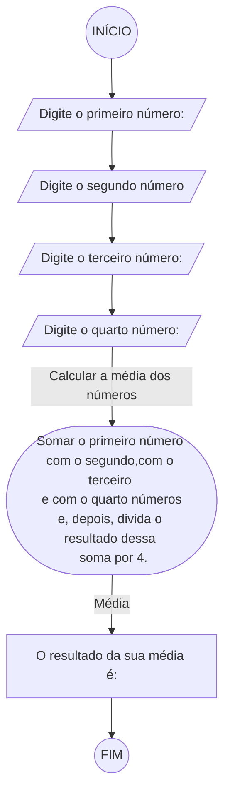
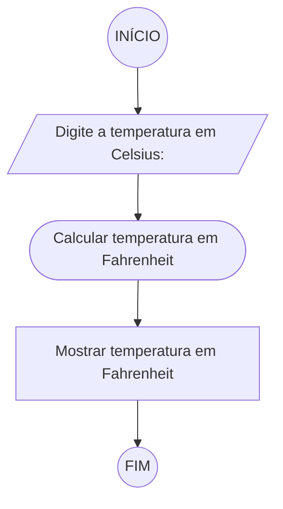
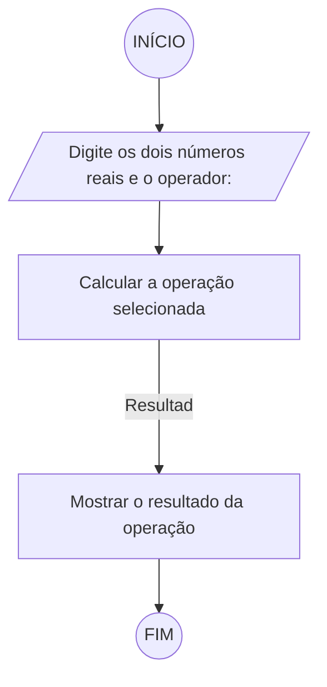

# Unifor - Lista de Exercícios 02
 **Nome:** Vinicius Albuquerque <br>
 **Matrícula:** 2417683 <br>
 **Disciplina:** Raciocínio Lógico Algorítmico <br>
 **Professor:** Ricardo Carubbi <br>

## Exercício 1 
### Fluxograma

### Pseudocódigo
```
1. ALGORITMO calcular_media
2. DECLARE numero1, numero2, numero3, numero4: REAL
3. DECLARE media: POSITIVO
4. ESCREVA "Digite o primeiro número: "
5. INICIO
6.     LEIA numero1
7.     ESCREVA "Digite o segundo número: "
8.     LEIA numero2
9.     ESCREVA "Digite o terceiro número: "
10.    LEIA numero3
11.    ESCREVA "Digite o quarto número: "
12.    LEIA numero4
13.    media = (numero1 + numero2 + numero3 + numero4) % 4
14.    ESCREVA "A média dos números é: ", media
15. FIM_ALGORITMO
```
### Teste de Mesa
| numero1 | numero2 | numero3 | numero4 | soma | media |
| -- | -- | -- | -- | -- | -- |
| 16 | (-8) | (-5) | 1 | 4 | 1 |
| 2 | 6 | 10 | (-8) | 10 | 2,5 |
| 12 | 3 | 5 | (-20) | 0 | 0|
| 0 | 9 | 106 | 5 | 120 | 30|


## Exercício 2
### Fluxograma

### Pseudocódigo
```
1. ALGORITMO converter_Celsius_Fahrenheit
2. DECLARE celsius, fahrenheit: REAL
3. ESCREVA "Digite a temperatura em Celsius: "
4. INICIO
5.     LEIA celsius
6.     fahrenheit = (9/5) * celsius + 32
7.     ESCREVA "A temperatura em Fahrenheit é: ", fahrenheit
8. FIM_ALGORITMO
```
### Teste de Mesa
| Celsius | Fórmula                     | Fahrenheit |
| ------- | --------------------------- | -- |
| -10     | (9/5) * (-10) + 32 = 14     | 14 |
| 0       | (9/5) * 0 + 32 = 32         | 32 |
| 25      | (9/5) * 25 + 32 = 77        | 77 |
| 100     | (9/5) * 100 + 32 = 212      | 212|


## Exercício 03
### Fluxograma

### Pseudocódigo
```
1. ALGORITMO calcular_operacao
2. DECLARE numero1, numero2, resultado: REAL
3. DECLARE operador: CARACTERE
4. INICIO
5.     ESCREVA "Digite os dois números reais e o operador: "
6.     LEIA numero1, numero2, operador
7.     ESCOLHA operador
8.         SE "+"
9.             resultado = numero1 + numero2
10.        SE "-"
11.            resultado = numero1 - numero2
12.        SE "*"
13.            resultado = numero1 * numero2
14.        SE "/"
15.            resultado = numero1 / numero2
16.        SENÃO
17.            ESCREVA "Operador inválido!"
18.    FIM_ESCOLHA
19.    ESCREVA "O resultado da operação é: ", 'resultado""
20. FIM_ALGORITMO

```
### Teste de Mesa
| numero1 | numero2  | Operador | Operação   | Resultado        |
| -- | -- | -------- | ---------------------| ----------------- |
| 5  | 3  | +        | 5 + 3 = 8            | 8                 |
| 10 | 9  | -        | 10 - 2 = 8           | 1                 |
| 4  | 6  | *        | 4 * 6 = 24           | 24                |
| 12 | 4  | /        | 12 / 4 = 3           | 3                 |


