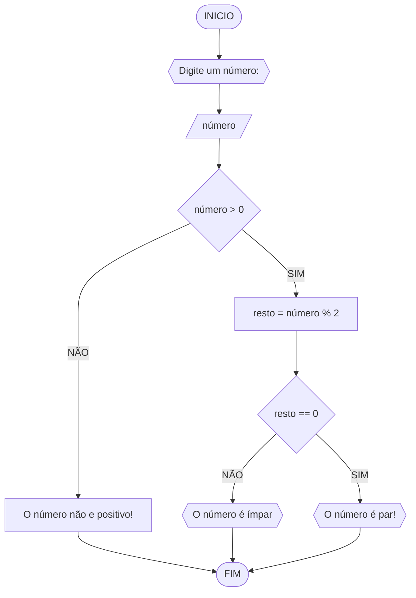
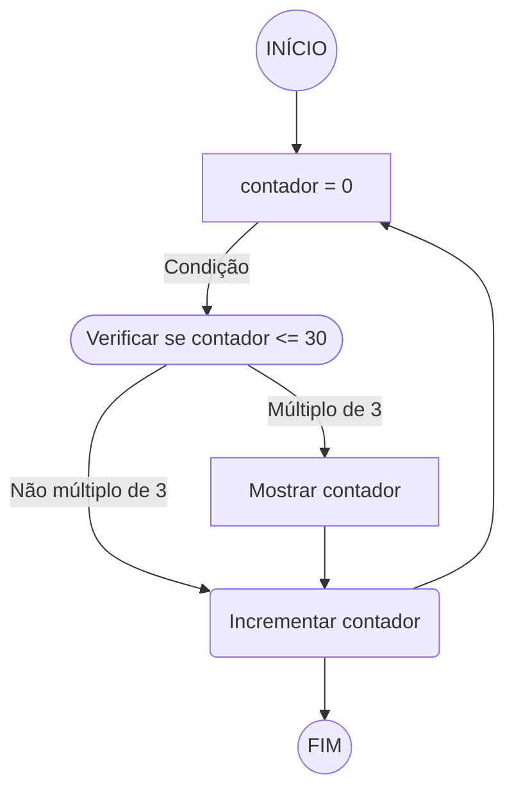
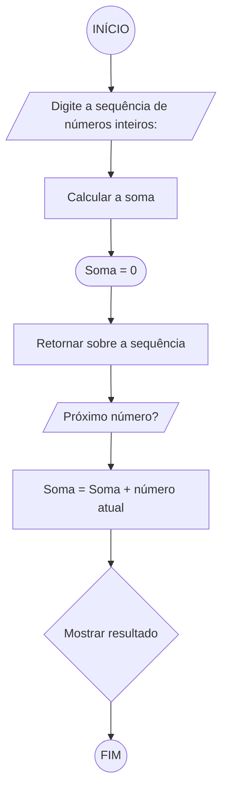
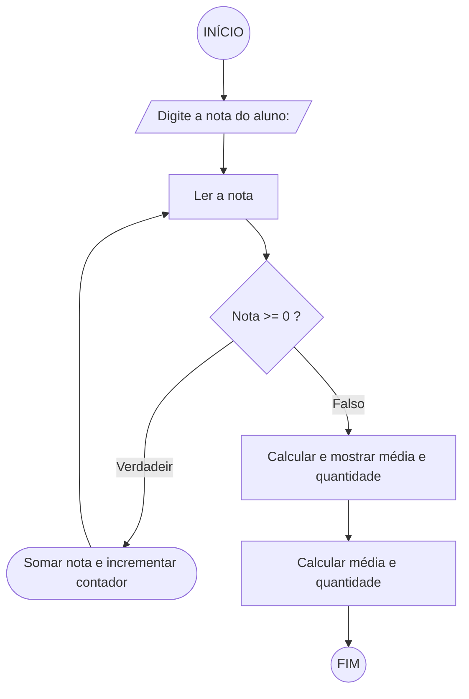

# Unifor - Lista de Exercícios 03
 **Nome:** Vinicius Albuquerque <br>
 **Matrícula:** 2417683 <br>
 **Disciplina:** Raciocínio Lógico Algorítmico <br>
 **Professor:** Ricardo Carubbi <br>


## Exercício 01
### Fluxograma

### Pseudocódigo
```
1. ALGORITMO verificar_par_impar
2. DECLARE numero, resto: INTEIRO
3. INICIO
4.     ESCREVA "Digite um número: "
5.     LEIA numero
6.     ENQUANTO numero < 0 FAÇA
7.         ESCREVA "Por favor, digite um número maior ou igual a zero: "
8.         LEIA numero
9.     FIM_ENQUANTO
10.    SE numero % 2 == 0 ENTÃO
11.        ESCREVA numero, " é um número par."
12.    SENÃO
13.        ESCREVA numero, " é um número ímpar."
14.    FIM_SE
15. FIM_ALGORITMO
```
### Teste de Mesa
| Numero | numero >= 0 | Resultado             |
| ------ | ----------- | --------------------- |
| -5     | False       | Digite um número maior ou igual a zero |
| 0      | True        | 0 é um número par.    |
| 7      | True        | 7 é um número ímpar.  |
| 12     | True        | 12 é um número par.   |


## Exercício 02
### Fluxograma

### Pseudocódigo
```
1. ALGORITMO exibir_multiplos_de_tres
2. DECLARE contador: INTEIRO
3. INICIO
4.     contador ← 0
5.     ENQUANTO contador <= 30 FAÇA
6.         SE contador % 3 == 0 ENTÃO
7.             ESCREVA contador
8.         FIM_SE
9.         contador ← contador + 1
10.    FIM_ENQUANTO
11. FIM_ALGORITMO
```
### Teste de Mesa
| contador | contador <= 30 | Múltiplo de 3 | Saída |
| -------- | -------------- | --------------| ----- |
| 0        | True           | True          | 0     |
| 1        | True           | False         | -     |
| 2        | True           | False         | -     |
| 3        | True           | True          | 3     |
| 4        | True           | False         | -     |
| ...      | ...            | ...           | ...   |
| 30       | True           | True          | 30    |


## Exercício 03
### Fluxograma

### Pseudocódigo
```
1. ALGORITMO calcular_soma_sequencia
2. INICIO
3.     ESCREVA "Digite a sequência de números inteiros separados por vírgula:"
4.     LEIA sequencia
5.     soma ← 0
6.     PARA cada numero EM sequencia FAÇA
7.         soma ← soma + numero
8.     FIM_PARA
9.     ESCREVA "A soma da sequência é:", soma
10. FIM_ALGORITMO
```
### Teste de Mesa
| sequencia        | soma |
| ---------------- | ---- |
| {12, 17, 4, -6, 8, 0} | 35   |
| {-10, -5, 0, 5, 10} | 0    |
| {100, -50, 25, -12, 8} | 71   |
| {2, 4, 6, 8, 10, 12, 14, 16, 18, 20} | 110  |
| {3, -7, 11, -15, 19, -23} | -12  |


## Exercício 04
### Fluxograma

### Pseudocódigo
```
1. ALGORITMO calcular_media_alunos
2. INICIO
3.     soma_notas ← 0
4.     contador_notas ← 0
5.     ESCREVA "Digite a nota do aluno (digite uma nota negativa para encerrar):"
6.     LEIA nota
7.     ENQUANTO nota >= 0 FAÇA
8.         soma_notas ← soma_notas + nota
9.         contador_notas ← contador_notas + 1
10.        ESCREVA "Digite a nota do próximo aluno (digite uma nota negativa para encerrar):"
11.        LEIA nota
12.    FIM_ENQUANTO
13.    SE contador_notas > 0 ENTÃO
14.        media ← soma_notas / contador_notas
15.        ESCREVA "A média das notas é:", media
16.        ESCREVA "Foram lidas", contador_notas, "notas."
17.    SENÃO
18.        ESCREVA "Nenhuma nota foi digitada."
19.    FIM_SE
20. FIM_ALGORITMO
```
### Teste de Mesa
| Nota   | Nota >= 0 | Soma das notas | Contador | Média  | Saída                              |
| ------ | --------- | -------------- | -------- | ------ | ---------------------------------- |
| 7      | True      | 7              | 1        | -      | -                                  |
| 5      | True      | 12             | 2        | -      | -                                  |
| -2     | False     | 12             | 2        | 6      | A média das notas é: 6. Foram lidas 2 notas.     |
| -2     | False     | 69             | 14       | 6.75   | Foram lidas 14 notas. A média aritmética é 6.75! |
