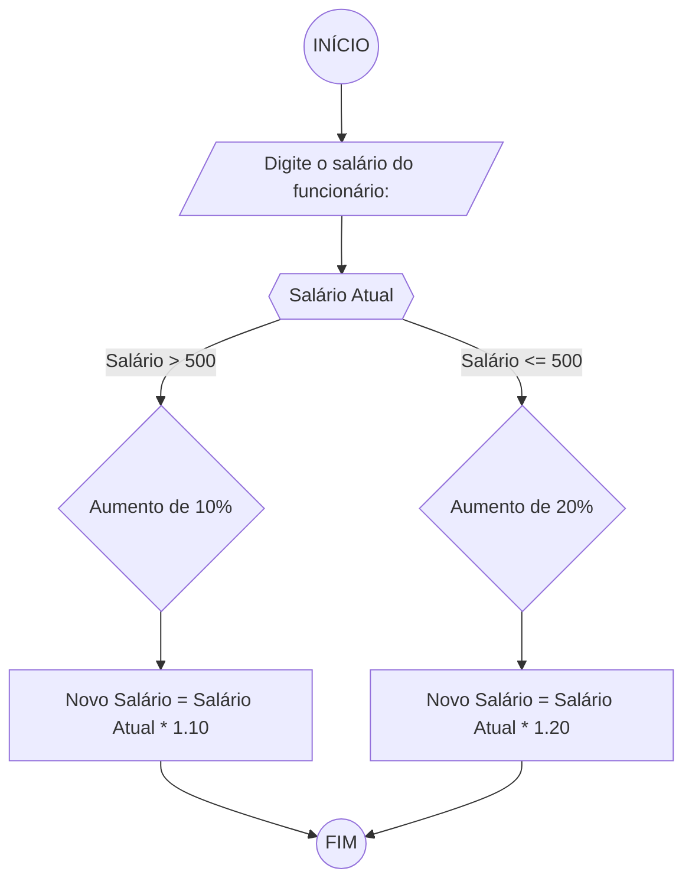
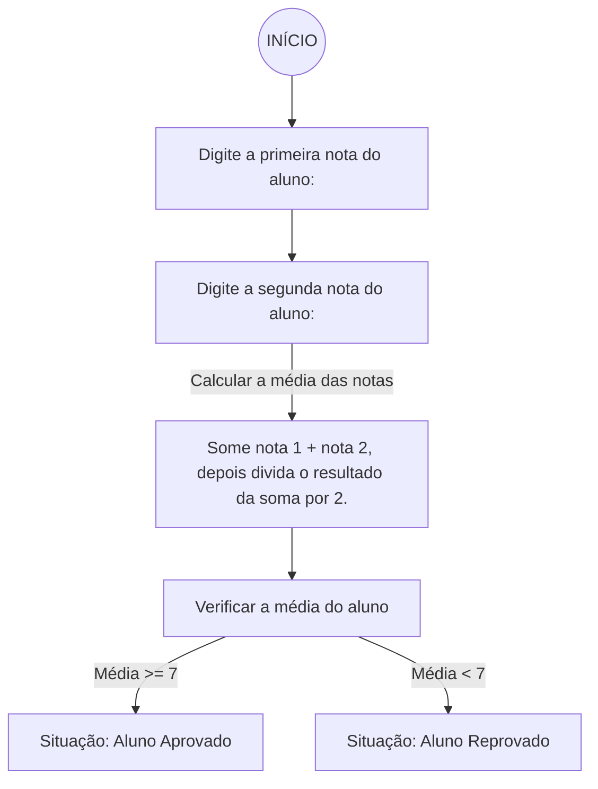

# Unifor - Lista de Exercícios 01
**Nome:** Vinicius Albuquerque
**Disciplina:** Raciocínio Lógico Algorítmico

## Exercício 1 
### Fluxograma

### Pseudocódigo
```
1  ALGORITMO verifica_par_ímpar
2  DECLARE número, resto NUMÉRICO
3  ESCREVA "Digite um número"
4  LEIA número
5  SE número > 0
6     resto = número % 2
7     SE resto == 0 ENTÃO
8        ESCREVA "O número é par!"
9     SENÃO
10       ESCREVA "O número não é ímpar!"
11  SENÃO
12    ESCREVA "O número não é positivo"
13  FIM_ALGORITMO 
```
### Teste de mesa
| Número | Número >= 0 | resto | resto == 0 | Mensagem                      |
| --     | --          | --    | --         | --                            | 
| -1     | F           |       |            | "O número deve ser postivo!"  |
| 0      | V           | 0     | V          | "O número é par!"             |
| 13     | V           | 1     | F          | "O número é ímpar!"           |
| 30     | V           | 0     | V          | "O número é par!"             |


## Exercício 2 
### Fluxograma

### Pseudocódigo
```
1 ALGORITMO calcula_aumento_salário
2 DECLARE salario, novo_salario: REAL
3 ESCREVA "Digite o salário atual do funcionário: "
4 INICIO
5     LEIA salario
6     SE salario <= 500 ENTAO
7         novo_salario = salario * 1.20
8     SENÃO
9         novo_salario = salario * 1.10
10    FIM_SE
11    ESCREVA "Novo salário do funcionário: ", novo_salario
12 FIM_ALGORITMO
```
### Teste de mesa

| Salário Atual| Salário Atual <= 500 | Novo Salário                               | 
|      --      |      --              |      --                                    |
| R$ 501.00    | F                    | Multiplique o Salário Atual por 1.10       |
| R$ 500.00    | V                    | Multiplique o Salário Atual por 1.20       |
| R$ 499.00    | V                    | Multiplique o Salário Atual por 1.20       |


## Exercício 3 
### Fluxograma

### Pseudocódigo
```
1. ALGORITMO calcula_media_situacao 
2. DECLARE nota1, nota2, media: REAL 
3. INICIO
4. ESCREVA "Digite a primeira nota do aluno: " 
5.   LEIA nota1 
6. ESCREVA "Digite a segunda nota do aluno: " 
7.   LEIA nota2 
8. CALCULE media = (nota1 + nota2) % 2 
9.   SE media >= 7
10.    ENTAO, ESCREVA "Aluno Aprovado"
11.  SENAO 
12.     ESCREVA "Aluno Reprovado" 
13.  FIM_SE 
14. FIM_ALGORITMO
```

