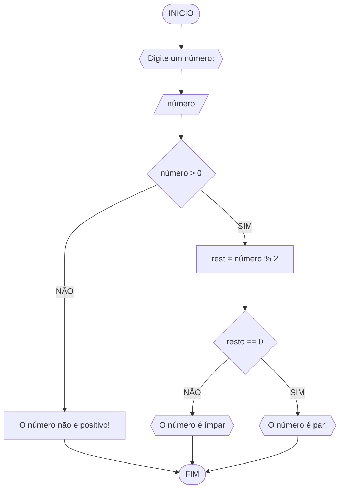
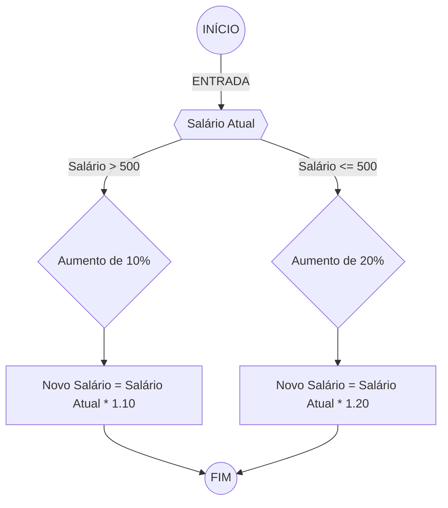

# Unifor - Lista de Exercícios 01
**Nome:** Vinicius Albuquerque
**Disciplina:** Raciocínio Lógico Algorítmico

## Exercício 1 
### Fluxograma


### Pseudocódigo
```
1  ALGORÍTMO verifica_par_ímpar
2  DECLARE número, resto NUMÉRICO
3  ESCREVA "Digite um número"
4  LEIA número
5  SE número > 0
6     resto = número % 2
7     SE resto == 0 ENTÃO
8        ESCREVA "O número é par!"
9     SENÃO
10       ESCREVA "O número não é ímpar!"
11  SENÃO
12    ESCREVA "O número não é positivo"
13  FIM_ALGORÍTMO 
```
### Teste de mesa
| Número | Número >= 0 | resto | resto == 0 | Mensagem |
| -- | -- | -- | -- | -- | 
| -1 | F |   |   | "O número deve ser postivo!" |
| 0  | V | 0 | V | "O número é par!" |
| 13 | V | 1 | F | "O número é ímpar!" |
| 30 | V | 0 | V | "O número é par!" |


## Exercício 2 
### Fluxograma

### Pseudocódigo
```
Algoritmo ContaAprovacoes
FIM_ALGORITMO
```

### Teste de mesa

| Salário Atual| Salário Atual <= 500 | Novo Salário                               | 
|      --      |      --              |      --                                    |
| 501          | F                    | Multiplique o Salário Atual por 1.10       |
| 500          | V                    | Multiplique o Salário Atual por 1.20       |
| 499          | V                    | Multiplique o Salário Atual por 1.20       |


