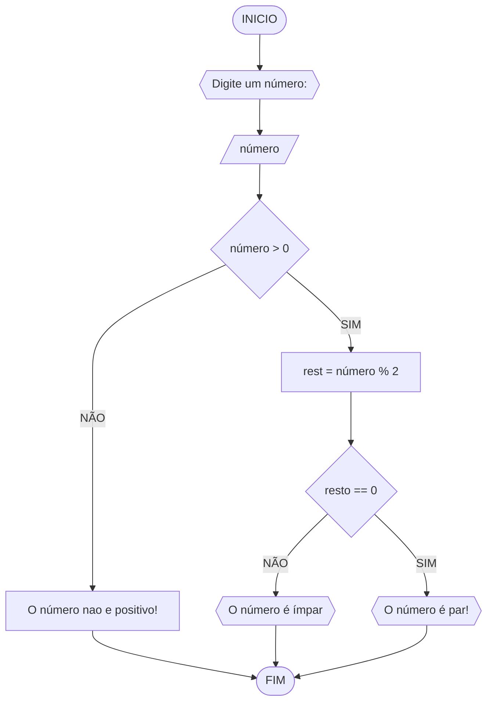

# Unifor
** Nome: ** Vinicius Albuquerque
** Disciplina:** RLA

## Exercício 3 
### Fluxograma

```mermaid
flowchart TD  
  A([INICIO]) --> B{{Digite um número: }}
  B --> C[/número/]
  C --> D{número > 0}
  D --NÃO--> E[O número nao e positivo!]
  D --SIM--> F[rest = número % 2]
  E --> Z([FIM])
  F --> G{resto == 0}
  G --NÃO--> H{{O número é ímpar}}
  G --SIM--> I{{O número é par!}}
  H --> Z
  I --> Z
```
